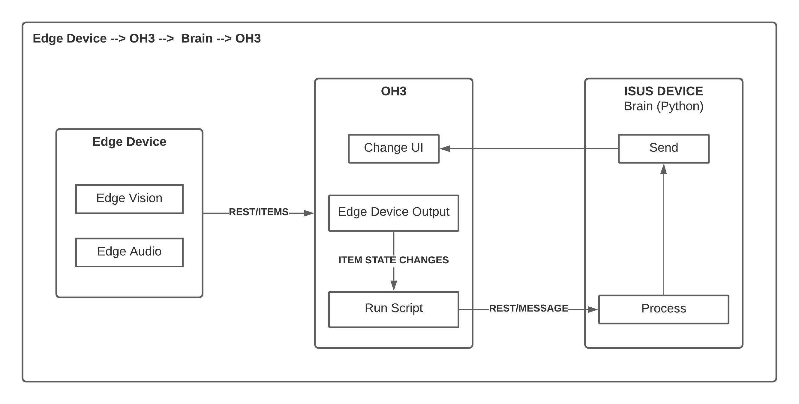

## **18/02/2021**
#### Contextualização do Projeto:
- ['Dive into Deep Learning' book](https://d2l.ai/)
- [Sound Classification (Generic)](https://mikesmales.medium.com/sound-classification-using-deep-learning-8bc2aa1990b7)
- [Sound Classification (Birds)](https://www.edgeimpulse.com/blog/bird-classification-lacuna-space)
- [Google Public Datasets](https://research.google/tools/datasets/)

#### Investigar o uso das seguintes ferramentas:
- [Tensorflow](https://www.tensorflow.org/)
- [PyTorch](https://pytorch.org/)
- [OpenCV](https://opencv.org/)
- [OpenHab](https://www.openhab.org/)

## **25/02/2021**
#### Por onde começar:

- Som:
  - Utilizar um modelo já feito e colocar a funcionar (Exemplo: Som dos pássaros)
   Posteriormente, introduzir conceitos nossos (ex. agua a correr, chuveiro, torneira, etc).
- Visão:
  - Analisar o trabalho do Aguiar

- Fazer o nosso próprio Binding consoante os sensores no openHab
  - Exemplo de estrutura: 
    - HTTP Binding (A mensagem em json deverá conter: hora, atividade e a accuracy, por exemplo).

## **04/03/2021**

#### Definir alguns Casos de Uso:
- Detetar acontecimentos passiveis de emergência (queda de alguma pessoa).
- Deduzir um horário dos ocupantes da casa (ex. não está em casa das 9h as 17h).
  - Reportar um alerta se for detetada uma presença nessa altura (ex. possível ladrão).
- Detetar uma fuga de água (ex. se for detetada torneira aberta mais do que 1h).
- Apagar a luz da divisão se não for detetado nenhum movimento.

Exemplo:
Deteto que a torneira está aberta e a pessoa sai da divisão (Poderá ser um alerta preventivo)
Se continuar, aumentar o grau do alerta.

- Criar o nosso próprio modelo com apenas as classes necessárias (casos de uso) ou 
  re-treinar um modelo já existente.
  - [Model Retrainig Example](https://www.tensorflow.org/hub/tutorials/tf2_image_retraining) 
  - Observações:
    - _model_handel_ <=> yamnet
    - (...) _.Dense_ ( novo numero de classes)

- Novo Dataset: [FreeSound50K](https://zenodo.org/record/4060432) (200 Classes)

## **11/03/2021**

#### Discussão de diagramas de workflow do projeto:

.jpeg)

- Limitar as classes para apenas os casos de uso a desenvolver.

## **18/03/2021**

- Testar com ficheiros audio gravados e testar.
- Usar code ufp pt para partilhar codigo com os orientadores do projeto.
- Tratamento/processamento de dados é necessário (Fazer step-by-step através da gravação para ficheiro).
- Usar a biblioteca mais tarde PyAudio para detetar diretamente no microfone o audio.
- Testar conjuntos para teste e conjuntos para treino.
